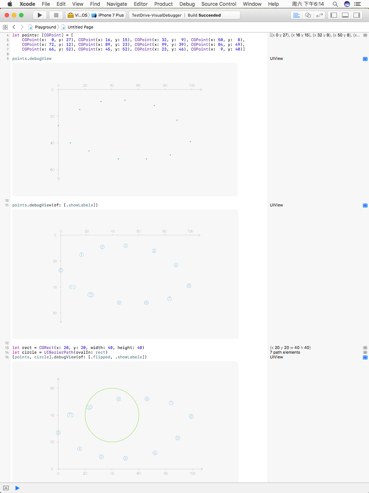
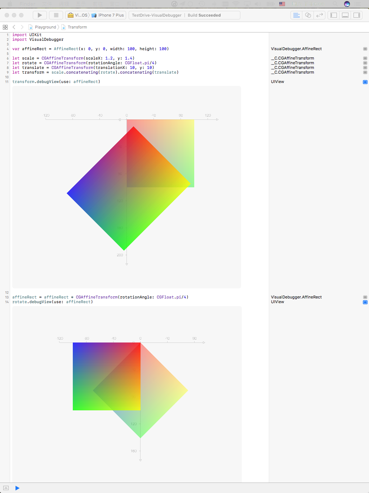

## VisualDebugger

 The most elegant and easiest way to visual you data in playground

it's perfect to work with [TestDrive](https://github.com/JohnSundell/TestDrive), to try it just type: "testDrive VisualDebugger"

## Features

- [x] support CocoaPods, Carthage, Swift Package Manager
- [x] support visual debug draw bezier path
- [x] support visual debug [CGPoint], with different styles
- [x] support visual debug CGAffineTransform
- [x] support choose proper 2d coordinate system
- [x] Single source file

## Sneak peek



## Requirements

- iOS 8.0+ | macOS 10.11+ | tvOS 9.0+ 
- Xcode 8

## Installation

#### CocoaPods
You can use [CocoaPods](http://cocoapods.org/) to install `VisualDebugger` by adding it to your `Podfile`:

```ruby
platform :ios, '8.0'
use_frameworks!

target 'MyApp' do
  pod 'VisualDebugger', '~> 1.0.0'
end
```

#### Carthage
Create a `Cartfile` that lists the framework and run `carthage update`. Follow the [instructions](https://github.com/Carthage/Carthage#if-youre-building-for-ios) to add `$(SRCROOT)/Carthage/Build/iOS/VisualDebugger.framework` to an iOS project.

```
github "chenyunguiMilook/VisualDebugger" ~> 1.0.0
```
#### Manually
1. Download and drop ```VisualDebugger.swift``` into your project.  
2. Congratulations!  

#### Swift Package Manager

You can use [The Swift Package Manager](https://swift.org/package-manager) to install `VisualDebugger` by adding the proper description to your `Package.swift` file:

```swift
import PackageDescription

let package = Package(
    name: "PROJECT_NAME",
    targets: [],
    dependencies: [
        .Package(url: "https://github.com/chenyunguiMilook/VisualDebugger.git", majorVersion: 1)
    ]
)
```

