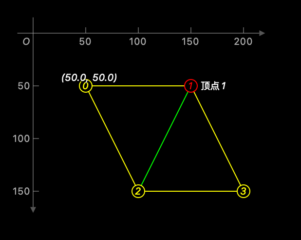

# VisualDebugger

[中文文档](./readme-cn.md)

The most elegant and easiest way to visualize your data in source files. VisualDebugger is a powerful Swift library that helps you debug geometric data structures directly in your code with visual representations.

## Features

- [x] Support for multiple coordinate systems (yUp, yDown)
- [x] Visual debugging of Mesh structures
- [x] Visual debugging of Polygon collections with customizable styles
- [x] Visual debugging of Bezier paths
- [x] Visual debugging of Lines, Dots, and Polygons
- [x] Support for iOS and macOS platforms
- [x] Flexible style customization system
- [x] Detailed coordinate axis display and labeling
- [x] Zoom and pan capabilities
- [x] Custom vertex and edge styling
- [x] Face coloring and transparency control

## Requirements

- iOS 17.0+ | macOS 15+
- Swift 6.0+
- Xcode 16+

## 构建与测试

### 核心命令
- **标准构建**: `swift build`
- **Mac Catalyst 17**: 
  ```bash
  xcodebuild -scheme VisualDebugger -destination "generic/platform=macOS,variant=Mac Catalyst" build
  ```
- **运行测试**: `swift test`

## Installation

### Swift Package Manager

You can use [Swift Package Manager](https://swift.org/package-manager) to install `VisualDebugger` by adding it to your `Package.swift` file:

```swift
import PackageDescription

let package = Package(
    name: "YOUR_PROJECT_NAME",
    dependencies: [
        .package(url: "https://github.com/chenyunguiMilook/VisualDebugger.git", from: "3.0.0")
    ],
    targets: [
        .target(
            name: "YOUR_TARGET_NAME",
            dependencies: ["VisualDebugger"]),
    ]
)
```

### CocoaPods

Add the following line to your Podfile:

```ruby
pod 'VisualDebugger'
```

Then run `pod install`.

## Core Components

### DebugView

The main view that displays your debug visualizations. You can customize its appearance and behavior with various parameters:

```swift
DebugView(
    minWidth: Double = 250,
    numSegments: Int = 5,
    showOrigin: Bool = false,
    showCoordinate: Bool = true,
    coordinateSystem: CoordinateSystem2D = .yDown,
    coordinateStyle: CoordinateStyle = .default,
    elements: [any DebugRenderable]
)
```

### Supported Debuggers

- **Polygon**: Visualize collections of points with customizable styles
- **Mesh**: Debug mesh structures with vertices, edges, and faces
- **Line**: Visualize line segments with various styles
- **Dot**: Display points with custom shapes and labels
- **VectorMesh**: Advanced mesh visualization with vector data

## Usage Examples

### Debugging Polygons

```swift
#Preview(traits: .fixedLayout(width: 400, height: 420)) {
    DebugView {
        Polygon([
            .init(x: 40, y: 10),
            .init(x: 10, y: 23),
            .init(x: 23, y: 67)
        ], vertexShape: .index)
        .setVertexStyle(at: 0, shape: .shape(Circle(radius: 2)), label: "Corner")
        .setVertexStyle(at: 1, style: .init(color: .red), label: .coordinate())
        .setEdgeStyle(at: 2, shape: .arrow(.doubleArrow), style: .init(color: .red, mode: .fill))
        .show([.vertex, .edge])
    }
    .coordinateVisible(true)
    .coordinateStyle(.default)
    .coordinateSystem(.yDown)
    //.zoom(1.5, aroundCenter: .init(x: 10, y: 23))
}
```


### Debugging Mesh Structures

```swift
#Preview(traits: .fixedLayout(width: 400, height: 420)) {
    let vertices = [
        CGPoint(x: 50, y: 50),
        CGPoint(x: 150, y: 50),
        CGPoint(x: 100, y: 150),
        CGPoint(x: 200, y: 150)
    ]
    
    let faces = [
        Mesh.Face(0, 1, 2),
        Mesh.Face(1, 3, 2)
    ]
    
    DebugView(showOrigin: true) {
        Mesh(vertices, faces: faces)
            .setVertexStyle(at: 0, shape: .index, label: .coordinate(at: .top))
            .setVertexStyle(at: 1, style: .init(color: .red), label: "顶点1")
            .setEdgeStyle(for: .init(org: 2, dst: 1), style: .init(color: .green))
            .setFaceStyle(at: 0, color: .blue, alpha: 0.2)
    }
}
```



### Customizing Coordinate System

You can customize the coordinate system display:

```swift
DebugView {
    // Your debug elements here
}
.coordinateVisible(true)  // Show/hide coordinate system
.coordinateSystem(.yUp)  // Change between .yUp and .yDown
```

### Styling Options

VisualDebugger provides extensive styling options for vertices, edges, and faces:

```swift
// Vertex styling
.setVertexStyle(
    at: index,                    // Vertex index
    shape: .circle,               // Shape (.circle, .square, .index, etc.)
    style: .init(                 // Style properties
        color: .red,
        mode: .stroke,
        lineWidth: 1.5
    ),
    label: "Custom Label"         // Optional label
)

// Edge styling
.setEdgeStyle(
    at: index,                    // Edge index
    shape: .arrow(.line),  // Shape (.line, .arrow, etc.)
    style: .init(                 // Style properties
        color: .blue,
        mode: .fill,
        lineWidth: 1.0
    )
)

// Face styling
.setFaceStyle(
    at: index,                    // Face index
    color: .green,                // Fill color
    alpha: 0.3                    // Transparency
)
```

## Advanced Usage

### Capturing Debug Views

You can capture debug views to images for documentation or sharing:

```swift
let image = DebugCapture.captureToImage {
    DebugView {
        // Your debug elements
    }
}
```

### Creating Snapshots of Program Execution

VisualDebugger allows you to create snapshots during program execution to visualize the process:

```swift
// Create a capture instance
DebugCapture.shared = DebugCapture(context: context, folder: folder)

// During execution, capture snapshots at different stages
func processAlgorithm() {
    // Initial state
    let points = [CGPoint(x: 10, y: 20), CGPoint(x: 30, y: 40)]
    DebugCapture.shared?.captureElements("Initial State") {
        Polygon(points, vertexShape: .circle)
    }
    
    // After first transformation
    let transformedPoints = transform(points)
    DebugCapture.shared?.captureElements("After Transformation") {
        Polygon(transformedPoints, vertexShape: .circle)
    }
    
    // Final result
    let result = finalProcess(transformedPoints)
    DebugCapture.shared?.captureElements("Final Result") {
        Polygon(result, vertexShape: .circle)
    }
    
    // Generate visualization of the entire process
    DebugCapture.shared?.output()
}
```

This approach is invaluable for debugging complex algorithms or visualizing step-by-step processes.

### Using DebugContext for Quick Visualization in Debugger

You can create a `DebugContext` directly to visualize your data structures during debugging. This is especially useful when you want to inspect geometric data in Xcode's debugger:

```swift
// Create a debug context with your data - elements must be provided during initialization
// for correct view size calculation
let vertices = [CGPoint(x: 10, y: 20), CGPoint(x: 30, y: 40), CGPoint(x: 50, y: 10)]
let debugContext = DebugContext(elements: [Polygon(vertices, vertexShape: .circle)])

// Alternatively, you can set additional parameters
let debugContext = DebugContext(
    minWidth: 300,
    numSegments: 8,
    showOrigin: true,
    showCoordinate: true,
    coordinateSystem: .yDown,
    coordinateStyle: .default,
    elements: [Polygon(vertices, vertexShape: .circle)]
)

// In debug mode, you can use Quick Look to visualize the data
// Just hover over the debugContext variable and click the eye icon
// Or use the debugQuickLookObject() method
```

This approach allows you to quickly visualize complex geometric structures directly in the debugger without having to set up a full DebugView in your UI.

### Custom Debugging Elements

You can create custom debugging elements by conforming to the `DebugRenderable` protocol:

```swift
struct CustomDebugElement: DebugRenderable {
    // Implementation details
}
```


## License


VisualDebugger is available under the MIT license. See the LICENSE file for more info.
