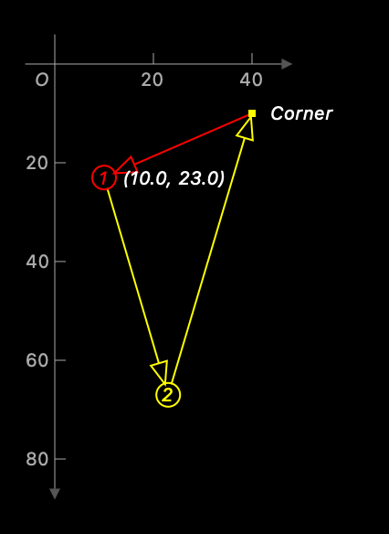
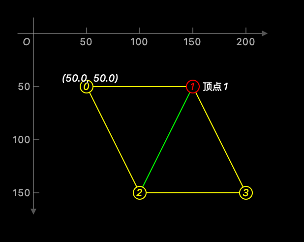

# VisualDebugger

最优雅、最简单的方式在源文件中可视化您的数据。VisualDebugger 是一个强大的 Swift 库，帮助您直接在代码中通过可视化表示调试几何数据结构。

## 功能特点

- [x] 支持多种坐标系统（yUp, yDown）
- [x] 支持可视化调试Mesh网格结构
- [x] 支持可视化调试多边形（Polygon）及样式定制
- [x] 支持可视化调试贝塞尔路径
- [x] 支持可视化调试线条、点和多边形
- [x] 支持iOS和macOS平台
- [x] 灵活的样式定制系统
- [x] 详细的坐标轴显示和标注
- [x] 缩放和平移功能
- [x] 自定义顶点和边缘样式
- [x] 面的颜色和透明度控制

## 系统要求

- iOS 17.0+ | macOS 15+
- Swift 6.0+
- Xcode 16+

## 安装方法

### Swift Package Manager

您可以使用[Swift Package Manager](https://swift.org/package-manager)安装`VisualDebugger`，只需将其添加到您的`Package.swift`文件中：

```swift
import PackageDescription

let package = Package(
    name: "YOUR_PROJECT_NAME",
    dependencies: [
        .package(url: "https://github.com/chenyunguiMilook/VisualDebugger.git", from: "3.0.0")
    ],
    targets: [
        .target(
            name: "YOUR_TARGET_NAME",
            dependencies: ["VisualDebugger"]),
    ]
)
```

### CocoaPods

将以下行添加到您的 Podfile 中：

```ruby
pod 'VisualDebugger'
```

然后运行 `pod install`。

## 核心组件

### DebugView

显示调试可视化的主视图。您可以通过各种参数自定义其外观和行为：

```swift
DebugView(
    minWidth: Double = 250,
    numSegments: Int = 5,
    showOrigin: Bool = false,
    showCoordinate: Bool = true,
    coordinateSystem: CoordinateSystem2D = .yDown,
    coordinateStyle: CoordinateStyle = .default,
    elements: [any DebugRenderable]
)
```

### 支持的调试器

- **Polygon**：使用可自定义样式可视化点集合
- **Mesh**：调试具有顶点、边和面的网格结构
- **Line**：使用各种样式可视化线段
- **Dot**：使用自定义形状和标签显示点
- **Polygon**：使用样式选项调试多边形形状
- **VectorMesh**：具有矢量数据的高级网格可视化

## 使用示例

### 调试多边形

```swift
#Preview(traits: .fixedLayout(width: 400, height: 420)) {
    DebugView {
        Polygon([
            .init(x: 40, y: 10),
            .init(x: 10, y: 23),
            .init(x: 23, y: 67)
        ], vertexShape: .index)
        .setVertexStyle(at: 0, shape: .shape(Circle(radius: 2)), label: "Corner")
        .setVertexStyle(at: 1, style: .init(color: .red), label: .coordinate())
        .setEdgeStyle(at: 2, shape: .arrow(.doubleArrow), style: .init(color: .red, mode: .fill))
        .show([.vertex, .edge])
    }
    .coordinateVisible(true)
    .coordinateStyle(.default)
    .coordinateSystem(.yDown)
    //.zoom(1.5, aroundCenter: .init(x: 10, y: 23))
}
```



### 调试网格结构

```swift
#Preview(traits: .fixedLayout(width: 400, height: 420)) {
    let vertices = [
        CGPoint(x: 50, y: 50),
        CGPoint(x: 150, y: 50),
        CGPoint(x: 100, y: 150),
        CGPoint(x: 200, y: 150)
    ]
    
    let faces = [
        Mesh.Face(0, 1, 2),
        Mesh.Face(1, 3, 2)
    ]
    
    DebugView(showOrigin: true) {
        Mesh(vertices, faces: faces)
            .setVertexStyle(at: 0, shape: .index, label: .coordinate(at: .top))
            .setVertexStyle(at: 1, style: .init(color: .red), label: "顶点1")
            .setEdgeStyle(for: .init(org: 2, dst: 1), style: .init(color: .green))
            .setFaceStyle(at: 0, color: .blue, alpha: 0.2)
    }
}
```



### 自定义坐标系统

您可以自定义坐标系统显示：

```swift
DebugView {
    // 您的调试元素
}
.coordinateVisible(true)  // 显示/隐藏坐标系统
.coordinateStyle(.init(
    axisColor: .blue,
    gridColor: .gray.opacity(0.3),
    textColor: .black,
    axisWidth: 1.5,
    gridWidth: 0.5,
    fontSize: 10
))
.coordinateSystem(.yUp)  // 在 .yUp 和 .yDown 之间切换
```

### 样式选项

VisualDebugger 为顶点、边和面提供了广泛的样式选项：

```swift
// 顶点样式
.setVertexStyle(
    at: index,                    // 顶点索引
    shape: .circle,               // 形状 (.circle, .square, .index 等)
    style: .init(                 // 样式属性
        color: .red,
        mode: .stroke,
        lineWidth: 1.5
    ),
    label: "自定义标签"           // 可选标签
)

// 边缘样式
.setEdgeStyle(
    at: index,                    // 边缘索引
    shape: .arrow(.line),  // 形状 (.line, .arrow 
    style: .init(                 // 样式属性
        color: .blue,
        mode: .fill,
        lineWidth: 1.0
    )
)

// 面样式
.setFaceStyle(
    at: index,                    // 面索引
    color: .green,                // 填充颜色
    alpha: 0.3                    // 透明度
)
```

## 高级用法

### 捕获调试视图

您可以将调试视图捕获为图像，用于文档或共享：

```swift
let image = DebugCapture.captureToImage {
    DebugView {
        // 您的调试元素
    }
}
```

### 创建程序执行过程的快照

VisualDebugger 允许您在程序执行过程中创建快照，以可视化整个过程：

```swift
// 创建捕获实例
DebugCapture.shared = DebugCapture(context: context, folder: folder)

// 在执行过程中，在不同阶段捕获快照
func processAlgorithm() {
    // 初始状态
    let points = [CGPoint(x: 10, y: 20), CGPoint(x: 30, y: 40)]
    DebugCapture.shared?.captureElements("初始状态") {
        Polygon(points, vertexShape: .circle)
    }
    
    // 第一次转换后
    let transformedPoints = transform(points)
    DebugCapture.shared?.captureElements("转换后") {
        Polygon(transformedPoints, vertexShape: .circle)
    }
    
    // 最终结果
    let result = finalProcess(transformedPoints)
    DebugCapture.shared?.captureElements("最终结果") {
        Polygon(result, vertexShape: .circle)
    }
    
    // 生成整个过程的可视化
    DebugCapture.shared?.output()
}
```

这种方法对于调试复杂算法或可视化逐步过程非常有价值。

### 使用 DebugContext 在调试器中快速可视化

您可以直接创建 `DebugContext` 来在调试过程中可视化您的数据结构。这在您想要在 Xcode 调试器中检查几何数据时特别有用：

```swift
// 创建包含您数据的调试上下文 - 必须在初始化时提供元素
// 以便正确计算视图大小
let vertices = [CGPoint(x: 10, y: 20), CGPoint(x: 30, y: 40), CGPoint(x: 50, y: 10)]
let debugContext = DebugContext(elements: [Polygon(vertices, vertexShape: .circle)])

// 或者，您可以设置其他参数
let debugContext = DebugContext(
    minWidth: 300,
    numSegments: 8,
    showOrigin: true,
    showCoordinate: true,
    coordinateSystem: .yDown,
    coordinateStyle: .default,
    elements: [Polygon(vertices, vertexShape: .circle)]
)

// 在调试模式下，您可以使用 Quick Look 来可视化数据
// 只需将鼠标悬停在 debugContext 变量上并点击眼睛图标
// 或使用 debugQuickLookObject() 方法
```

这种方法允许您直接在调试器中快速可视化复杂的几何结构，而无需在 UI 中设置完整的 DebugView。

### 自定义调试元素

您可以通过遵循 `DebugRenderable` 协议创建自定义调试元素：

```swift
struct CustomDebugElement: DebugRenderable {
    // 实现细节
}
```

## 许可证

VisualDebugger 使用 MIT 许可证。详情请参阅 LICENSE 文件。
